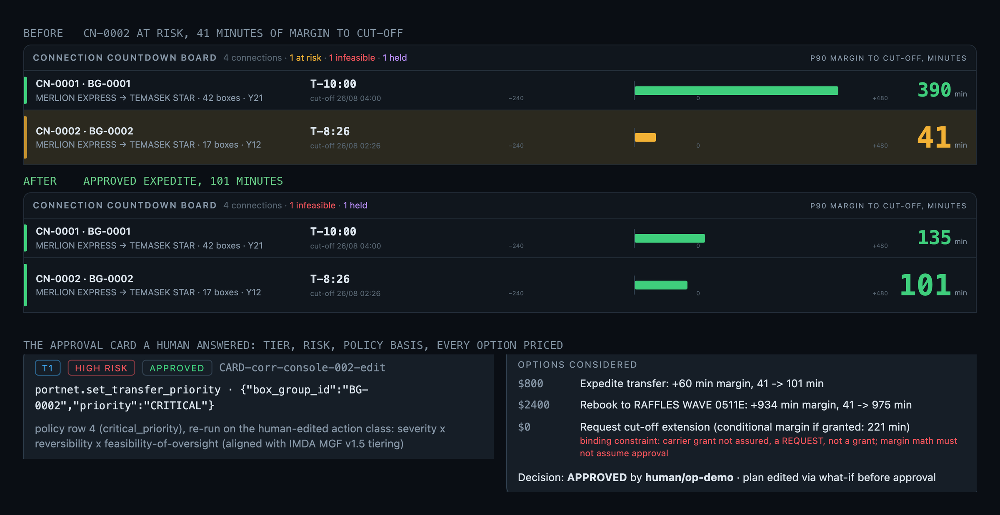
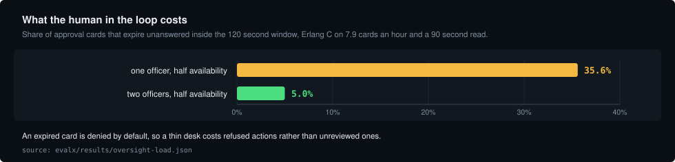
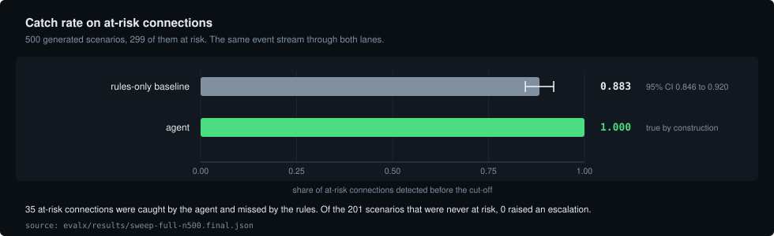
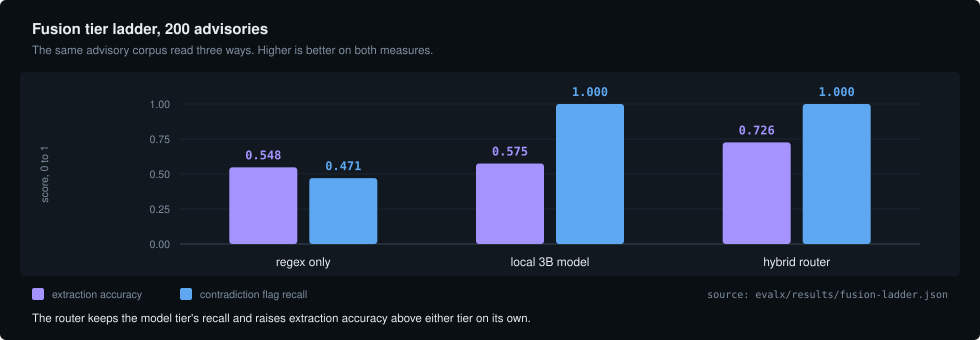
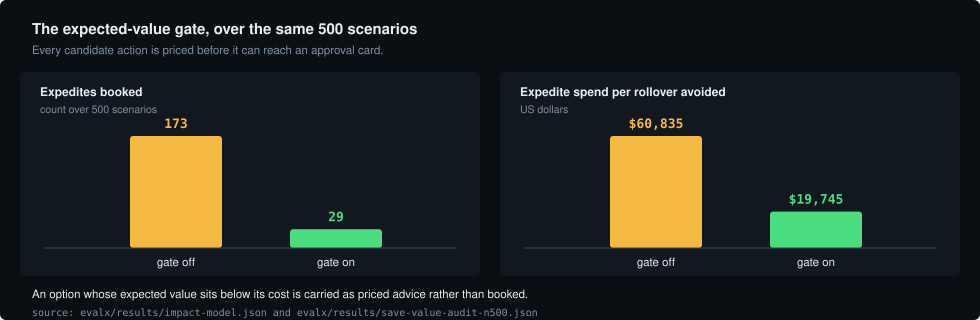

# RELAY, the transhipment Connection Guardian

RELAY is the exception layer a container terminal runs in the hours after a plan breaks:
it works out which transhipment connections are about to be missed, re-plans the shift's
limited budget against a digital twin, and puts every action in front of a human as a
priced, reversible decision on a tamper-evident record.




## What it does

1. Reads six structured event types and the free-text advisories carriers send, then
   reconciles what the text says against what the terminal's own systems say.
2. Computes the margin between every connection's ready time and its cut-off, and labels
   it feasible, at risk or infeasible from that arithmetic rather than from an opinion.
3. Allocates one shift's limited budget across all competing connections at once with
   OR-Tools CP-SAT, and prices every candidate action before proposing it.
4. Raises an approval card carrying the tier, the risk basis, every option considered and
   the constraint that ruled each one out, and denies by default if nobody answers.
5. Appends every step, refusals and tool failures included, to a hash-chained ledger that
   replays and verifies from this repository.

## Architecture


Each box is a node in the LangGraph decision graph, and the colour names what owns the
step. The lower band is the four contracted tool servers and the ledger every step
appends to.

## How it decides

| Owner | What it decides | What it cannot do |
|---|---|---|
| Language model | Turns one free-text advisory into structured facts, each with a confidence and a dissent flag | Choose a tool, a tier or an action |
| Twin and CP-SAT solver | Feasibility from margin arithmetic, and how one shift's budget is spread across competing connections | Write anything to the terminal |
| Policy table | The autonomy tier, from the action class, its severity, its reversibility and how well a human can oversee it | Read the advisory text |
| Duty officer | Approves, edits or refuses each card before anything moves | Approve what the policy routes to a supervisor |
| Write gate | Whether a call carries a single-use approval token bound to the arguments the human saw | Execute while a tool fault is open |

Holding a decision open costs desk time, and that cost is measured rather than assumed.



## Evidence

Every number below comes from a committed measurement script, is written to a results
file, and is bound to this page by `evalx/claims_check.py`, which fails if a page and a
results file disagree.







| Measurement | Result | Results file |
|---|---|---|
| Catch rate on at-risk connections, N = 500 seeded scenarios | rules-only 0.883 (95% CI 0.846 to 0.920) against the agent at 1.00, with 35 caught only by the agent | `evalx/results/sweep-full-n500.final.json` |
| Detection lead, connections saved, escalations on scenarios never at risk | 81.5 min ahead of the rules baseline (95% CI 72.0 to 90.9), save rate 0.579, 0/201 | same file |
| Re-planner against a competent greedy comparator, 567 broken connections | CP-SAT saves 423 at 74.6%, greedy 408 at 72.0%, and CP-SAT is never worse | `twin/solver_quality.json` |
| Expected-value gate, same scenarios, gate off then on | 173 expedites with the gate off at USD 60,835 of expedite spend per rollover avoided, against 29 booked with the gate on at 19,745 of expedite spend per rollover avoided | `evalx/results/impact-model.json`, `save-value-audit-n500.json` |
| Prompt injection driven through the real graph, 12 advisories | 9 of the 12 escalate before a tool is chosen at all; 3 reached a tool choice and none of them made an unsafe call | `evalx/results/fusion-ladder.json` |
| Safety controls parsed out of the deliverables, then switched off one at a time | 56 controls named by the deliverables, 48 of the 56 are probed, 5 are named as unprobed with the reason, 3 live outside this code; 56 probes, 56 caught, 0 survived, 0 invalid | `docs/CONTROL-CENSUS.json`, `evalx/results/mutation-probes.json` |
| Recorded Singapore AIS, two partial days | 151,906 messages, 1,551 vessels seen, 146 with a moored transition, of which 20 had a qualifying revision before mooring; median warning lead 282.1 min | `evalx/results/ais-warning-lead.json` |
| Modelled value of a rollover avoided | USD 27,152 per rollover avoided, with the assumptions and the sensitivity in the same file | `evalx/results/impact-model.json` |

Two of those numbers are true by construction and marked as such wherever they appear:
the at-risk ground truth is the same feasibility engine the agent calls, so the agent's
catch rate and the 0/201 are wiring rather than findings. The full workings, the
ablations, the external berth-allocation benchmark and the measurements that came out
badly are in [`deliverables/EVIDENCE-SHEET.md`](deliverables/EVIDENCE-SHEET.md).

## Run it

Python 3.11 or later. Nothing below needs network access or an API key.

```bash
python3 -m venv .venv && .venv/bin/pip install -r requirements.txt
.venv/bin/python -m stubs.selftest      # contract stubs and frozen fixtures: prints ALL PASS
.venv/bin/python -m pytest -q           # about eight minutes on a laptop
.venv/bin/python evalx/scorecard.py     # reproduces the oracle pack, then scores the eval cases
.venv/bin/python console/demo_walk.py   # the whole path headless: prints DEMO WALK: ALL BEATS HOLD
```

`evalx/scorecard.py` refuses to score anything until the oracle pack reproduces, and every
skipped test prints its reason. To open the console, run `.venv/bin/python console/server.py`
and visit `http://127.0.0.1:8765`.

## Documents

| Document | What is in it |
|---|---|
| [`deliverables/ARCHITECTURE-AND-CONTROLS.md`](deliverables/ARCHITECTURE-AND-CONTROLS.md) | Architecture, execution flow, key decisions, impact, security, safety and scalability |
| [`deliverables/EVIDENCE-SHEET.md`](deliverables/EVIDENCE-SHEET.md) | Every measurement with the file that produced it, including the ones that came out badly |
| [`deliverables/FALSIFICATION-CERTIFICATE.md`](deliverables/FALSIFICATION-CERTIFICATE.md) | The control census, and what happens when each control is switched off |
| [`docs/CONTRACT.md`](docs/CONTRACT.md) | The frozen interface: event schema, tool signatures, the autonomy table, tier routing and the trace schema |
| [`docs/SECURITY-REVIEW.md`](docs/SECURITY-REVIEW.md) | STRIDE-lite over the system, with a rerunnable command against every row |
| [`docs/GOVERNED-EDIT-PATTERN.md`](docs/GOVERNED-EDIT-PATTERN.md) | How a human edits an agent's plan without discarding the policy that made it safe |
| [`deliverables/deck/RELAY-PSA-CodeSprint-2026.pdf`](deliverables/deck/RELAY-PSA-CodeSprint-2026.pdf) | The submission deck for PSA Code Sprint 2.0, with [an appendix](deliverables/deck/RELAY-PSA-CodeSprint-2026-appendix.pdf) |

## Data and limits

- Every terminal state, connection, vessel and advisory is synthetic, labelled
  `"label": "SYNTHETIC"` in the data itself and shaped to DCSA Port Call 2.0 and JIT
  message structures. One event carries a real ETA-drift magnitude recorded over the
  aisstream.io WebSocket; vessel names are a salted hash of the MMSI and no raw recording
  is committed.
- There is no PORTNET integration. The adapter is a mock, berth and arrival-time changes
  are advisory only by design, and the console ships with demo role-based access control.
- Sweep numbers are simulator-internal: worlds generated from cited public rates, graded
  by the agent's own feasibility engine, under a simulated approver who never declines.
- A rebooking is a proposal. The plan counts the box as saved once it is allocated to the
  next sailing, but the margin against the original cut-off does not move until the
  carrier grants it.
- The local 3B model is the weakest component and its measured error rates are published
  rather than smoothed. An episode plans across the connections its own evidence touches,
  not the whole board.
- RELAY is aligned with IMDA's Model AI Governance Framework for Agentic AI v1.5 and CSA's
  Securing Agentic AI addendum v1.0. It is not certified and it has not been audited, and
  the ledger is tamper-evident rather than immutable.

## Licence

MIT, see [`LICENSE`](LICENSE). Dependencies are MIT, Apache, BSD or CC0 only and are listed
with their terms in [`THIRD-PARTY.md`](THIRD-PARTY.md). No keys are in the tree: `.env` is
ignored and `.env.example` carries variable names with empty values.
